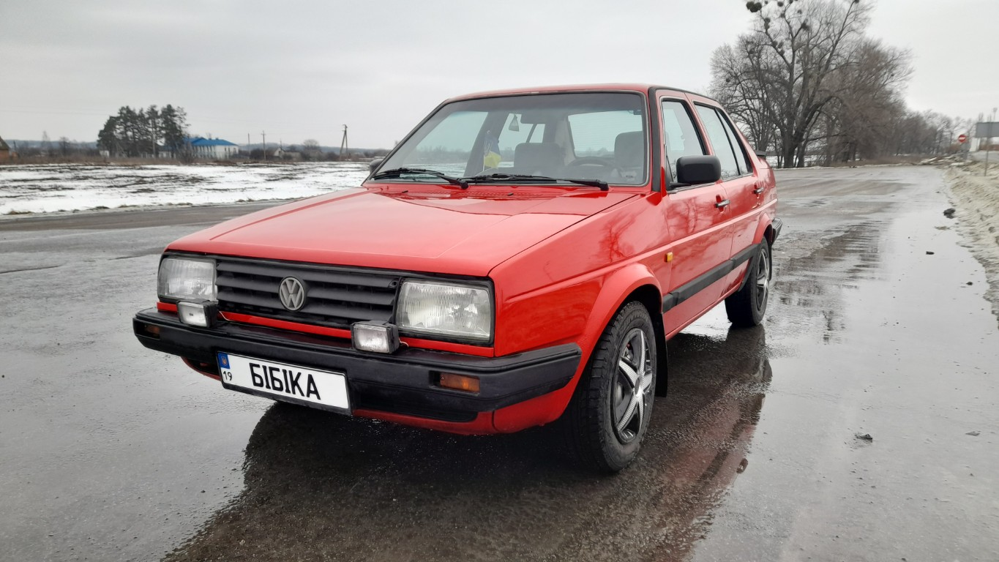
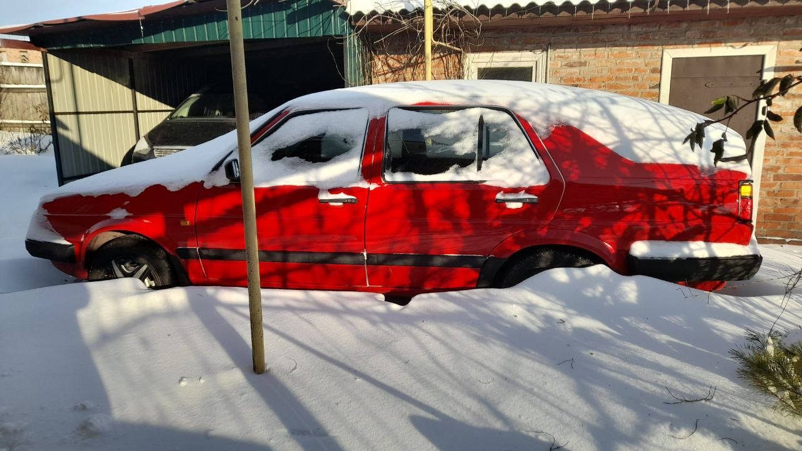
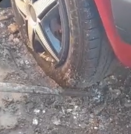
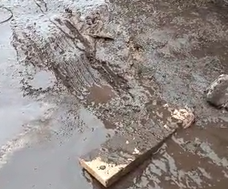

Hi, I have my ol' reliable Volkswagen Jetta Mk2. A car worth several separate posts of her own. 
When I got my driver's license, I had two options: 
- give my savings to parents and buy shared car
- keep my savings and try to restore wife's family car

I initially planned to go with 1st option, but our tastes in cars were drastically different
and the car my wife suggested me to repair was a sedan. And you know, I love sedans, I don't know why, 
but they are my weakness.

This winter was especially wild in terms of temperature and snow quantities. 
Despite our efforts car is still managed to stuck to the ice below. In ideal world we should keep her in garage,
or on the concrete, but we plan to move out from the current place so car containment is less than ideal now.

To understand the amount of the snow, just look at this transformation to wagon xD

Now imagine that this snow is now melting. To be precise - it fully melted in 2-3 days. Our yard transformed from 
snowy wonderland to muddy swamp instantly. Soil was so much soaked - that car just with its own mass started 
"drowning" in this bog.

On the first day of our battle to free the Bibika (adapted: Honker :D)
I was crushing ice with the big iron rod to prevent car from clipping on the ice
\+ this, in theory, helped the ice to melt the other day under the sunlight.

    
    

The second day was the day of success, I released the clutch in pulses to move the car 
straight and backwards while my wife pushed the car. On the 3rd try I finally managed
to move out of the pit. 

This place on the yard usually does not get so much water, so everything was ok. 
I flattened the pits from wheels, but this experience was something. 

Keep your wheels dry :) Alex