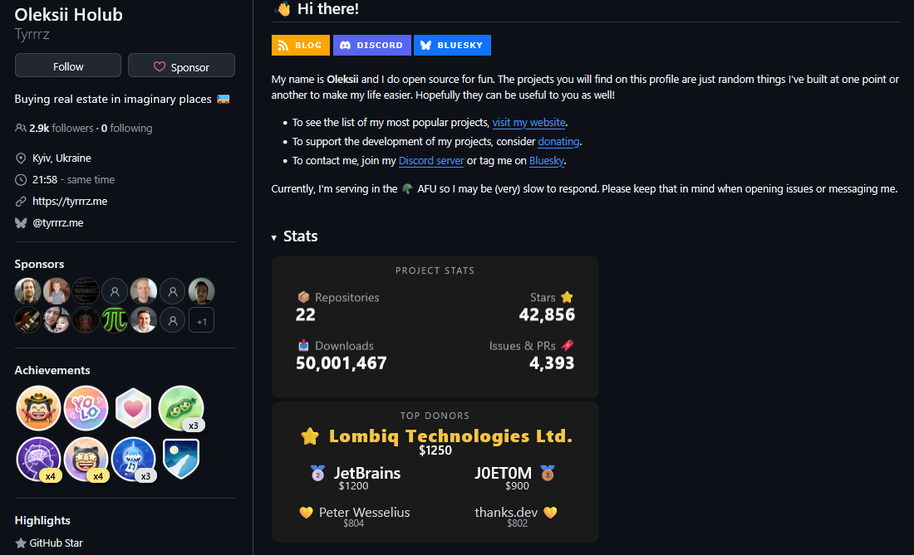
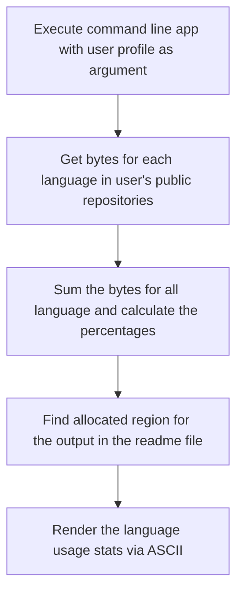
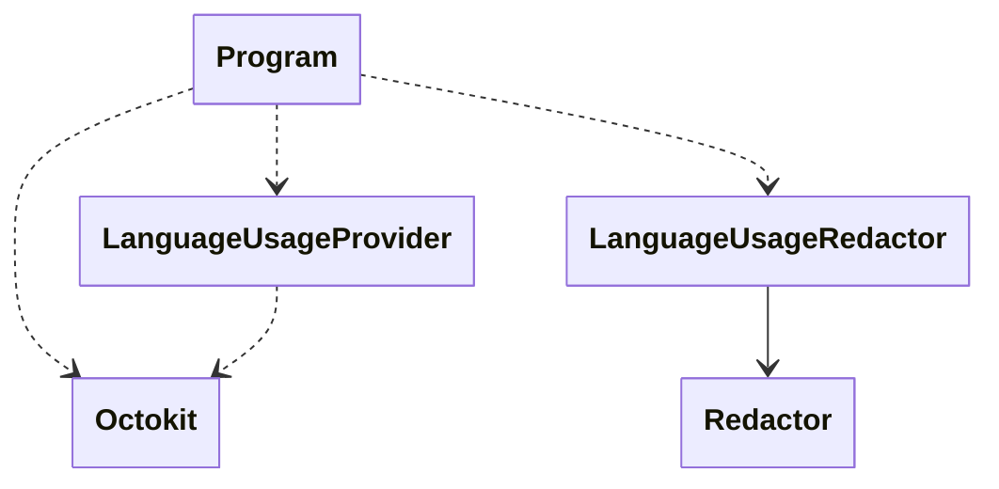
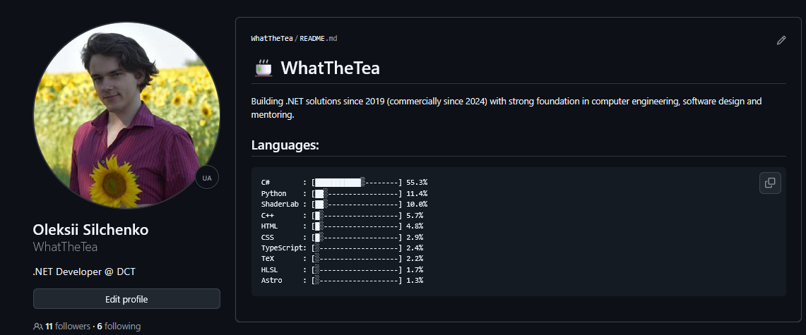

I've seen many fancy github profiles with various stats from coding time to overall activity.

There are countless actions on the marketplace to do this, ranging from dynamic SVG card generators to full-fledged IDE time trackers. Most popular solutions rely on generating dynamic SVG image cards (often hosted on external Vercel or Heroku endpoints) to showcase Linguist language distributions, commit counts, or repository stars. Other actions hook into third-party APIs like WakaTime to display actual time spent coding per language rather than sheer byte weight. 

While dynamic SVG cards look slick, they come with trade-offs: external image servers can hit GitHub API rate limits, dynamic SVGs often clash with dark/light mode switches, and third-party services require extra API keys and background tracking.

As it happens with adopting external libraries, my desired functionality was far less that existing solutions are providing. I estimated the task of creating purely ASCII generator based on github linguist statistics as a fun little exercise for my software design skills.

I had something like this in my head before starting the implementation:

After gathering some info on the implementation bits I decided to start with simple C# single file script with Octokit in order to build simple prototype. First PoC was just writing github profile name to the console output and a list of languages on each repository. Tinkering with prototype quickly introduced me the anonymous request limit for GitHub APIs.

This obstacle lead me to try TDD for this small project. The use case seemed perfect: it is just a console app, so testing here shouldn't make problems. The base architecture started to form from this approach:

With TDD I didn't have to waste API requests for each change in language usage rating or output format. Yeah, there are broader limits if you provide PAT, and I, in fact, implemented provisioning it. Instead of waiting for the API to respond, I spent this time writing unit tests, which was more fun and ensured I didn't break something each time something changed.

It was pleasant to work with Octokit, as there were abstractions I needed for the unit testing in the library. This way using NSubstitute was just enough and I was free from the writing wrappers in order for dependencies to be injectable.

I was planning to just append the stats to the end of the readme file and call it a day. But then I remembered about the code block notation, especially the syntax highlight hinting. This way, tool just ignores the file if there's no `wts-languages` section in the file. Updating the file is also easier this way, as I could just clear all the text in the code block.

There's still work to be done, though. Using this tool is kinda funky, but was easier to implement. [GitHub Action](https://github.com/WhatTheTea/WhatTheTea/blob/c96772764ebaf6279b5fc95c559b858bae97f4fb/.github/workflows/wts.yml) in the target special username repository builds dotnet project from the [whatthestats](https://github.com/WhatTheTea/whatthestats) repo, runs it and then applies the changes made by the tool.

This way I made customizable stats for myself that end up rendering as intended on any theme used. I hope there'll be 1-2 evenings to play with this project again, as the idea of comitting changes via automation is pretty interesting.

