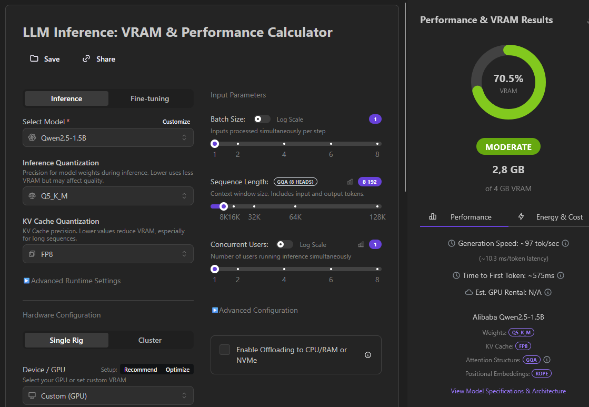
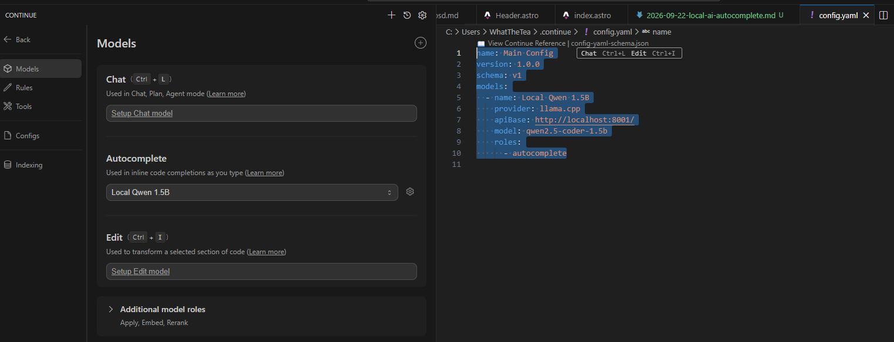

I like the whole concept of accelerating human development with some quality of life improvements. But I am always cautious of avoiding 
the "Automating 10 days the 10 minute tasks" scenario, so I spent one evening setting up a small tool that has been aiding me for several weeks now. 

## Philosophy

There are many tools starting from things like IntelliSense to whole agentic IDEs like Cursor or Replit. 
The whole idea of AI-driven development seems to backfire for some big players on the market, so I am not trying
to show you how to make software factory out of your machine here. 

You can call me kind of coding purist. I like to write code by hand, rather than be caught in endless refactoring of 
generated code. I like to have a good understanding of what I am doing and thinking about the selected solution. I think
I heard something about how doing something peripheral actually helps with active cognitive processes.

## My case
I bought my laptop back in 2020 and I could say that while the hardware is not top-tier, it is enough to work and relax.
Here's the exact tech specs:

| CPU | RAM | GPU | VRAM
|-|-|-|-|
Intel Core i7-9750HF | 16 GB | NVIDIA GeForce GTX 1650 | 4 GB

I liked the idea of AI completions, but if we take GitHub Copilot for example, I had many problems with how proactive 
it may be sometimes, it feels as it tries to write everything itself rather than helping you finish your thoughts. It 
may not be something objective, but experience is experience. 

## Easy solutions

You may just use GitHub Copilot or similar tools for the goal achieved in this blog. But here I am trying to use the
hardware I already paid for in order to accelerate my development without waiting for limits to refresh. It still takes
time to configure own autocompletes via extensions I will cover here even with models hosted by big players.

# Setup
## Selecting the model

We'll start with the model, we need something to fit within 4 GB of VRAM. All the quantization stuff with the models
is often about balancing the performance and how often the autocomplete we'll get actually helps us. After a quick research
I found out that Qwen Coder is considered a solid compact choice for such task, so to ensure we have enough VRAM we'll need to
use the [ApXml VRAM Calculator](https://apxml.com/tools/vram-calculator). Here I configured the hardware to somewhat match
the real one and chose the model. After fiddling with the configuration I stopped on 1.5B parameters and Q5_K_M inference 
quantization.  



## Running the model

To run the model we'll need inference engine and a model. I chose llama.cpp a while ago doing research on the various
AI aspects, so I think we could skip the installation process for it. There's also Ollama GUI app that I'd call the 
all-in-one solution for host models, but it felt bulky for such simple task. 

After I found the model on Hugging Face, I downloaded the quantization I need in a `.gguf` format for llama.cpp to work 
with it. You can find the exact model here: [Qwen 2.5 Coder 1.5B Q5_K_M](https://huggingface.co/RachidAR/Qwen2.5-Coder-1.5B-Q5_K_M-GGUF)

After running the model and ensuring it starts, I made a simple script on my desktop to launch it in the future:

```pwsh
llama-server -m D:\ai-models\qwen2.5-coder-1.5b-q5_k_m.gguf --port 8001 -ngl 99 -c 8192
```

So here I configured the llama-server to offload all possible layers to GPU (`-ngl 99`), and set the context width to 8192 tokens (`-c 8192`).


## Using the model

I am kinda used to VS Code in order to develop web software as it feels ergonomical enough for me to jump between 
the various tech I may use so it will be the first one to try out the model. For desktop projects I use plain Visual Studio
and there are some frictions with using llama.cpp because most of the extensions expect the Ollama server as a local model
provider. I found one extension to actually support the llama.cpp, but that feature is still in development at the moment 
and has issues with custom configuration.

So for the VS Code I ended up using the [Continue](https://marketplace.visualstudio.com/items?itemName=Continue.continue) 

After a small configuration here:


```yml
  - name: Local Qwen 1.5B
    provider: llama.cpp
    apiBase: http://localhost:8001/
    model: qwen2.5-coder-1.5b
    roles:
      - autocomplete
```

I got the local autocomplete working without issues. This way even using the more powerful models for chat or edit 
features you still save the tokens for basic autocomplete just utilizing the resources you already have on your machine.

